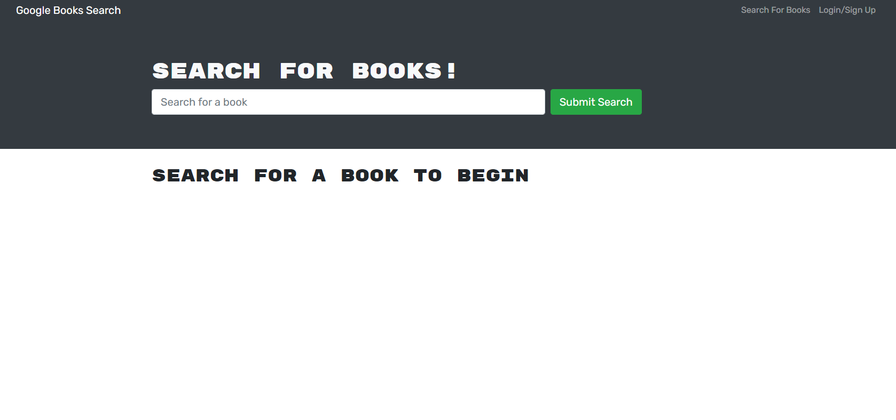

# Book Search Engine

Are you a fan of books? This application allows you to search for books and store them to your profile!

## Table of Contents
* [Npm Packages](#Npm-Packages/Dependencies)
* [Application](#Application)
* [Usage](#Usage)
* [Test](#Test)
* [Questions](#Questions)

## Npm Packages/Dependencies 
><b>Required to run this application:</b>
* jsonwebtoken
* Express
* Mongoose 
* Bcrypt
* GraphQL 
* Bootstrap
 
## Application
Here's the link for the deployed application hosted on [Heroku](https://sheltered-plateau-60223.herokuapp.com/).

## Usgae

Once you arrive on the home page you can either seach for books or creat a profile. You can't save book you've searched unless you create a profile. 

## Test

Screenshots below:</b>

</b>

## Questions
Do you have questions? Contact me here:
* [Github](https://github.com/jameleggleston)
* [Email](jamel.eggleston@gmail.com)

[Back to top](#Book-Search-Engine)
